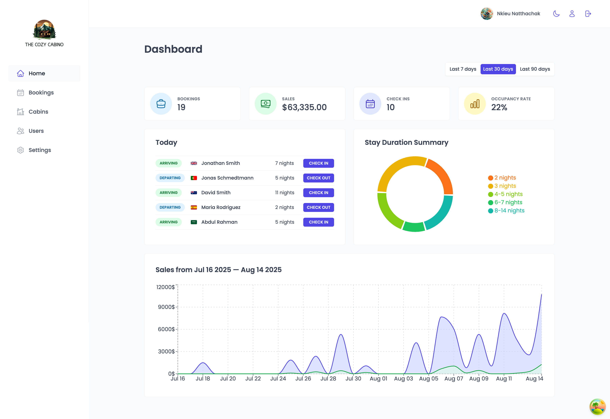
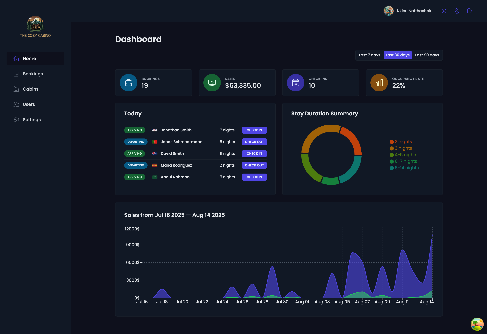
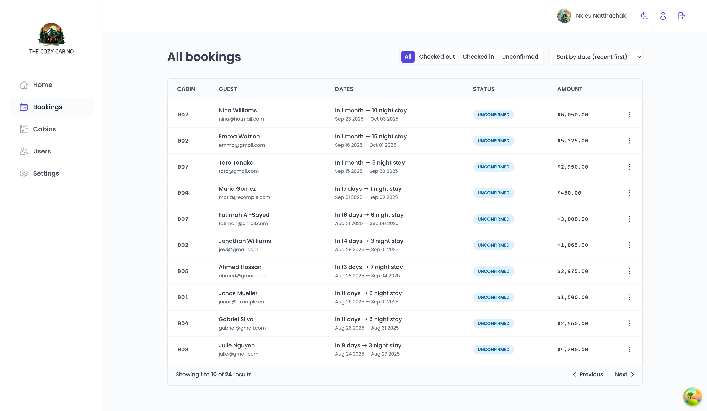
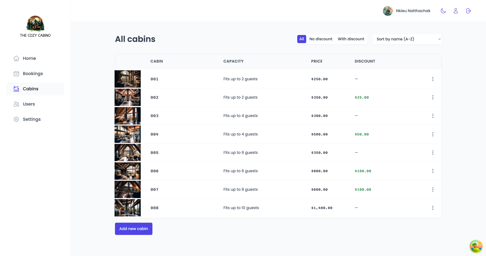
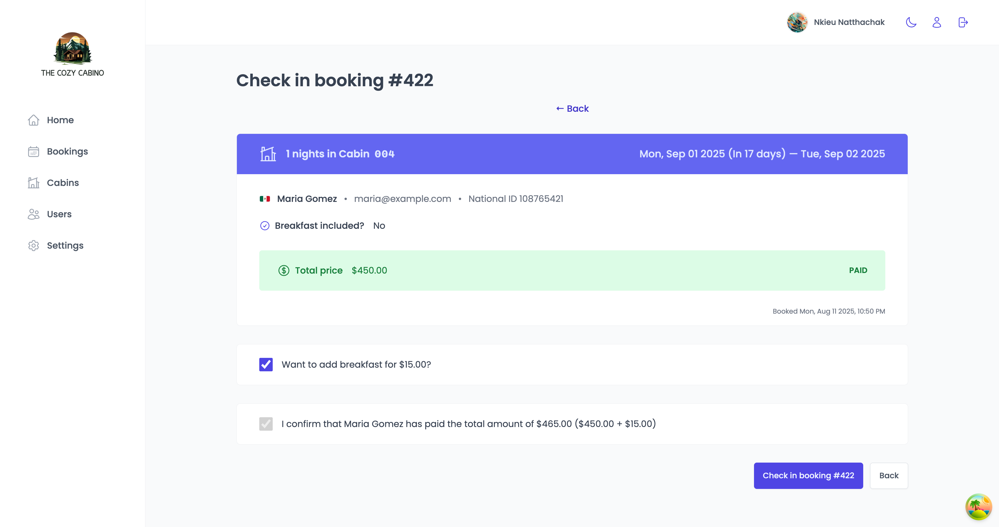
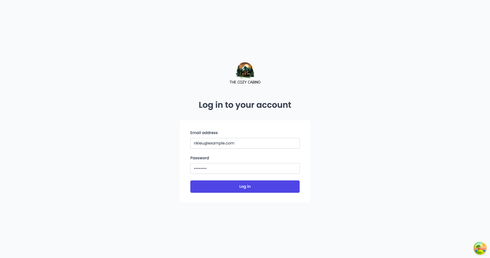

# 🏨 The Cozy Cabino App

A comprehensive hotel management application built with React ,Supabase, and modern React patterns. Staff can manage cabins, bookings, guests, and hotel settings through an intuitive dashboard interface with real-time data synchronization.

---

## 🌐 Live Demo

👉 [Try the live Application](https://nkieu-cozy-cabino.vercel.app)

---

## 📸 Screenshots

<table>
  <tr>
    <td></td>
    <td></td>
  </tr>
  <tr>
    <td></td>
    <td></td>
  </tr>
  <tr>
    <td></td>
    <td></td>
  </tr>
</table>

---

## ✨ Key Features

### 📊 Analytics Dashboard

- **Sales Charts** – Visual representation of revenue over time using `Recharts`
- **Occupancy Stats** – Real-time cabin occupancy and booking statistics
- **Duration Charts** – Analysis of stay durations and patterns
- **Today Activity** – Today's check-ins and check-outs at a glance

### 🏠 Cabin Management

- **CRUD Operations** – Create, read, update, and delete cabin records with images
- **Image Upload** – Upload and manage cabin photos via `Supabase Storage`
- **Filtering & Sorting** – Advanced table operations for efficient data browsing

### 📅 Booking System

- **Check-in/Check-out** – Streamlined process with breakfast add-on options
- **Payment Tracking** – Monitor payment status and manage financial records
- **Guest Management** – Complete guest information and booking history

### 👤 Authentication & Authorization

- **Secure Login** – JWT-based authentication with `Supabase Auth`
- **User Management** – Create new staff accounts with role-based access
- **Profile Updates** – Staff can update their profiles and avatars

### 🎨 User Experience

- **Dark Mode** – System-aware theme switching with manual override
- **Real-time Updates** – Instant data synchronization across all views
- **Toast Notifications** – Elegant feedback for all user actions

---

## 🧠 Learning Objectives

This application demonstrates mastery of advanced React concepts and modern development practices:

### ✅ React & Modern Patterns

- **React Router** – Advanced routing with nested layouts and `protected routes`
- **React Query (TanStack Query)** – Server state management with caching and prefetching
- **React Hook Form** – Performant forms with built-in validation
- **Custom Hooks** – Reusable logic extraction and composition
- **Error Boundaries** – Application-wide error handling

### ✅ State Management

- **Server State** – Managed with `React Query` for optimal caching
- **Local Storage** – Persistent user preferences (dark mode)
- **Context API** – Global UI state management (theme)

### ✅ Backend Integration

- **Supabase BaaS** – Complete backend solution with real-time capabilities
- **Row Level Security** – Database-level access control
- **Storage Management** – File uploads for avatars and cabin images
- **Authentication** – Secure user authentication and session management

### ✅ Professional Architecture

- **Feature-based Structure** – Organized by business domains
- **Compound Components** – Flexible and reusable UI patterns
- **Service Layer** – Separated API logic for maintainability

---

## 🛠️ Technology Stack

| Technology            | Description                |
| --------------------- | -------------------------- |
| **JavaScript**.       | Modern ES6+ features       |
| **React**             | JavaScript UI Library      |
| **React Router**      | Declarative routing        |
| **React Query**       | Server state management    |
| **Supabase**          | Backend as a Service       |
| **React Hook Form**   | Form management            |
| **Styled Components** | CSS-in-JS styling          |
| **Recharts**          | Data visualization         |
| **React Hot Toast**   | Toast notifications        |
| **date-fns**          | Date manipulation          |
| **Vite**              | Build tool and dev server. |

---

## 🚀 Installation & Setup

### Prerequisites

- Node.js 18+ and npm
- Supabase account and project

### 1. **Clone the repository**

```bash
git clone https://github.com/nkieu-config/cozy-cabino-app-project.git
```

### 2. **Install dependencies**

```bash
npm install
```

### 3. **Environment Setup**

Create a `.env` file in the root directory:

```env
VITE_SUPABASE_URL=your_supabase_project_url
VITE_SUPABASE_ANON_KEY=your_supabase_anon_key
```

### 4. **Database Setup**

Set up your Supabase database with the required tables:

- `cabins` - Hotel cabin information
- `bookings` - Guest bookings and reservations
- `guests` - Guest information
- `settings` - Hotel configuration

### 5. **Start the development server**

```bash
npm run dev
```

---

## 📚 Course Credit

This project was built as part of **[The Ultimate React Course 2025](https://www.udemy.com/course/the-ultimate-react-course/)** by [Jonas Schmedtmann](https://codingheroes.io/).

---

## 📃 License

This is a personal learning project. Not licensed for commercial use.
